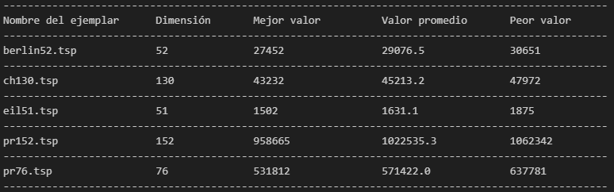

# Ejercicio 1
## 1. Codificación de ejemplares y soluciones
#### - Considerando el formato especificado en TSPLIB, implementa un algoritmo que lea un archivo con ejemplares para el TSP.
  Empleando la documentación de la librería [TSPLIB](http://comopt.ifi.uni-heidelberg.de/software/TSPLIB95/tsp95.pdf) nos basamos en el formato de los archivos para su lectura en _python_; cada archivo consiste en una parte de especificaciones y una parte para los datos. 
  
  La primera parte especifica las características del ejemplar con el formato _palabra clave : valor_, donde todas las palabras claves que se pueden utilizar, son: 
 - **NAME:** El nombre del problema
 - **TYPE:** El tipo de problema, como TSP, ATSP, CVRP, etc. (En nuestro caso todos son TSP)
 - **COMMENT:** Comentarios adicionales, como detalles o descripciones. (En algunos casos indica la ruta óptima encontrada)
 - **DIMENSION:** El número total de nodos o ciudades
 - **CAPACITY:** En problemas como CVRP, representa la capacidad del vehículo. (Opcional)
 - **EDGE_WEIGHT_TYPE:** Define cómo se calculan las distancias entre nodos ( En nuestro caso todos se calculan con la métrica euclidiana en dos dimensiones)
 - **EDGE_WEIGHT_FORMAT:** Especifica el formato de las distancias 
 - **NODE_COORD_TYPE:** Indica el tipo de coordenadas usadas para representar las posiciones de los nodos (por ejemplo, 2D o 3D).
 - **DISPLAY_DATA_TYPE:** Por default son en coordenadas
    
Entre otros que pueden ser opcionales según el ejemplar. Por lo tanto, observamos que dependiendo del archivo pueden variar los atributos que se vean mencionados, entonces no podemos empezar a leer el archivo desde una línea en particular. Sin embargo, notemos que cada una de estas palabras clave tiene un caracter en común, ":". Nos basamos en esta observación para almacenar las características del ejemplar en un diccionario, pues al momento de leer el archivo, si encuentra el caracter ":", va a dividir la cadena que esté leyendo en dos: lo que haya antes de los dos puntos (la palabra clave) y lo que exista después (el valor asociado a este atributo) imprime en pantalla los atributos de interés, que son los que corresponden al nombre, dimensión del ejemplar, entre otras especificaciones disponibles. Y a partir de un contador de líneas sabemos desde qué linea siguen los datos.

En la sección de datos, las primeras columnas que tenemos corresponden al _número de nodo_,y sus coordenadas. Los ejemplares utilizados fueron definidos en $\mathbb{R}^{2}$, por lo que sus coordenadas son en _x_ y en _y_. En otros ejemplares da información adicional. Entonces con la librería `pandas` guardamos la información mencionada en un _DataFrame_. 

La función que realiza el procedimiento anterior es `lectura_TSP(ejemplar)`, que recibe de parámetro un ejemplar de TSP con el formato especificado en TSPLIB y de parámetro opcional si se quiere imprimir en pantalla el nombre y la dimension del ejemplar; el valor por default es False, es decir no se imprime y de sí querer que se impriman en pantalla se coloca True. 
La función devuelve un diccionario con sus características y una tabla con los nodos y sus coordenadas.

A partir de los _n_ nodos y sus coordenadas, calculamos las distancias de _i_ a _j_ $d_{ij}$ para cualesquiera dos nodos de la gráfica, y las almacenamos en una matriz de  $n\cdot n$ que es la _matriz de distancias_; es importante guardarla en una función para llamarla las veces necesarias y no realizar los cálculos una y otra vez, sino que sólo los consultaríamos, esta matriz estará disponible con la función `matriz_distancias()`, cuya métrica será la euclidiana en $\mathbb{R}^{2}$, pues así lo especifican los ejemplares.

Empleando el hecho que $d(i,j) = d(j,i)$ reducimos la complejidad computacional del problema. Pues $d(1,j) = d(j,1)$ y así nos queda una matriz de $(n-1) \cdot (n-1)$ luego, $d(2,j) = d(i,2)$ y así sucesivamente. Por lo que sólo estaríamos calculando la mitad triangular superior derecha y usándola para completar el resto.

### - Implementa un algoritmo para generar soluciones aleatorias para el TSP, utilizando algún esquema de codificación basado en permutaciones

Para el ejemplar con _n_ nodos (ciudades), las soluciones se codificarán como vectores de n entradas. Donde los elementos en el arreglo son el número que identifica a cada uno de los nodos (ciudad) en el ejemplar y sus posiciones en el vector corresponden al orden en el cual se recorrerán las ciudades. 

Por otra parte, en un ejemplar de tamaño _n_ se tienen $n!$ permutaciones, para reducir este espacio fijamos a la primera ciudad (que se identifica con el _nodo 1_) y ya sólo tendríamos $(n-1)!$ permutaciones posibles. Observemos que entre más grande sea $n$ menos posibilidades hay que un programa te devuelva la misma permutación dos o más veces. 

Se utilizó la función _permutation()_ de la librería `numpy` para obtener permutaciones entre los números del 2 a _n_.

### - Implementa un algoritmo para evaluar una solución (permutación).

Dada una solución al ejemplar, en el esquema de codificación anterior y empezando el recorrido desde la ciudad 1; Obtenemos la distancia del nodo 1 a la ciudad con el índice que corresponde al número que ocupa el segundo lugar en el arreglo. Después la distancia de la segunda en el arreglo con la tercera y así sucesivamente hasta encontrar la distancia de la ciudad con índice el último número del arreglo hacia la ciudad 1 (Para cerrar el ciclo). 

Recordemos que estos datos de distancias no los tenemos que calcular cada vez que se ejecute el programa, sino que los podemos consultar en la matriz de distancias.

Por ejemplo si el ejemplar contiene 3 ciudades: $c_1, c_2,c_3$ y la solución generada aleatoriamente es 1,3,2 entonces de la ciudad uno se visitará la ciudad tres, de la tres a la dos y de la ciudad dos volvemos a la ciudad 1. La distancia total de este recorrido será:

$$
d_{Total} = d(c_1, c_3) + d(c_3 , c_2) + d(c_2,c_1)
$$

con:

$$
d(c_i , c_j ) = \sqrt{(x_i - x_j )^2 + (y_i - y_j)^2}
$$

La implementación de este algoritmo se encuentra en la función `evaluar_sol()` que recibe de parámetros el archivo con el ejemplar y una solución para éste en forma de una lista (vector) de números naturales.

## Para probar las implementaciones, deberán generar dos programas (ejecutables desde consola)
#### Programa que reciba como parámetros (en la misma línea de ejecución):
- Nombre del archivo con los datos del ejemplar
- Semilla del generador de aleatorio
- Nombre del archivo con los datos de la solución generada 

#### Como salida, deberá imprimir algunos datos generales del ejemplar leído. Por ejemplo:
- Nombre del ejemplar (archivo)
- Tamaño del ejemplar (número de ciudades)
- Arista de mayor peso (o distancia más grande)
- Ejemplo de solución (solo los primeras y los últimas 3 elementos de la permutación)
- En caso de que se haya indicado, se deberá escribir en un archivo de texto la solución generada (completa)

Para esta función llamada `lectura_ejemplar()` necesitamos de los parámetros: el nombre del archivo con el ejemplar, una semilla para generar la solución aleatoria y un nombre para el archivo donde se guardará la solución generada. Los parámetros de semilla y nombre del archivo con la solución son opcionales, de no ser especificados los valores por default que tomarán será el número aleatorio basado en la fecha, generado por la función `time.time()` de la librería `time`. 

Luego, dentro de este mismo archivo se llamarán de inicio a las funciones `lectura_archivo()`, `matriz_distancias()`, `np.permutation()` y `evaluar_sol()`. 

* `lectura_archivo()`: Utilizamos esta función y con el diccionario creado se imprimen en pantalla los valores de las palabras clave _NAME_ y _DIMENSION_, especificando que corresponden al nombre del ejemplar y a su número de ciudades.
* `matriz_distancias()`: Esta la utilizaremos para encontrar la arista de mayor peso; buscamos $ max \{ d_{ij} : i,j=1, \ldots, n \} $ que es la entrada ij-ésima de la matriz, y sus 
valores correspondientes de _i_ y de _j_ . Para esto, creamos la función `arista_mayor()` que recibirá de parámetro la matriz de distancias. Al ser una matriz cuadrada, 
consultamos su número de columnas y éste será también su número de renglones, _n_. Inicializamos 4 variables para guardar los valores de _i,j_, el mejor valor y la solución activa; dado que es una matriz con entradas 
no negativas (por ser distancias) las podemos iniciar con algún valor negativo, será -1. 
Después iteramos sobre las columnas y los renglones, comparamos el valor de la solución activa con el mejor valor encontrado y de ser mejor, 
la solución activa pasa a ser la mejor y guardamos los valores de _i_ y _j_ de donde encontramos ese valor máximo; nos quedamos con el obtenido
al final de las iteraciones. Imprimimos en pantalla la arista de mayor peso y entre cuáles nodos (i,j) se encuentra.

* `np.permutation()`: Creamos un arreglo aleatorio de n entradas, fijando la primera que será 1 y haciendo permutaciones entre los numeros naturales desde 2 hasta n.
imprimimos en pantalla los primeros 3 elementos y loz últimos tres, accedemos a éstos con los índices negativos -3,-2,-1 del arreglo. 

* `evaluar_sol()`: Evaluamos la solución generada aleatoriamente e imprimimos ese valor en pantalla.

Tanto el diccionario, la solución generada y su evaluación las escribimos en un archivo .txt con el nombre deseado. Se realizó con las funciones
`open()` y `write()`

#### Programa reciba como parámetros (en la misma línea de ejecución) :
- Nombre del archivo con los datos del ejemplar 
- Nombre del archivo con los datos de la solución a evaluar 

#### Como salida, deberá imprimir algunos datos generales del ejemplar leído. Por ejemplo:
- Nombre del ejemplar (archivo) 
- Tamaño del ejemplar (número de ciudades)
- Costo de la solución 

La función se llamará `lectura_sol()` y nuevamente, dentro de ella llamaremos de inicio a las funciones `lectura_archivo()`y `evaluar_sol()`.
* Con la función `lectura_archivo()` imprimimos el nombre del ejemplar y el tamaño del ejemplar.
* Adicionalmente, creamos una función llamada `leer_sol()` que recibe de parámetro el archivo donde se encuentra la solución. De primer instancia nos fijamos si en las primeras 
líneas se redactó algún atributo del ejemplar con que se hizo la solución. Siguiendo el formato TSPLIB, buscamos el caracter especial ":" y la información (de existir) la ponemos en el diccionario que se imprimirá en pantalla.
Después removemos los caracteres especiales de las siguientes cadenas y anexamos únicamente los enteros restantes a una lista que llamaremos solucion, luego esta solución y el nombre del ejemplar los metemos de parámetro en `evaluar_sol()`, que imprime la función de costo en pantalla.

# Ejercicio 2:

Primero, implementamos un operador de intercambio de dos elementos consecutivos para permutaciones:
1. Definimos una función llamada `operadorCambioConsecutivo()` que recibe como parámetros una permutación (en formato de lista) y un índice.
2. Creamos una nueva copia de la lista `permutacion` para no modificar la original y la guardamos en `nuevaPermutación`.
3. Si el índice proporcionado no es válido, se retorna simplemente la copia de la lista original.
4. Si el índice proporcionado es válido, intercambiamos el elemento al que corresponde el índice con el siguiente en la lista y retornamos la lista modificada. 

Luego, implementamos un operador de intercambio de dos elementos no necesariamente consecutivos:
1. Definimos una función llamada `OperadorNoConsecutivo()` que toma una lista `permutacion` y dos números (`indice1` y `indice2`).
2. Creamos una nueva copia de la lista `permutacion` para no modificar la original y la guardamos en `nuevaPermutación`.
3. Si alguno de los índices proporcionados no es válido o estos son iguales, se retorna simplemente la copia de la lista original.
4. Si los índices proporcionados son válidos y distintos, se intercambian los elementos correspondientes a los índices y se retorna la lista modificada.

Finalmente, implementamos un operador que parte a la lista en dos partes y las intercambia:
1. Definimos una función llamada `OperadorInvParticion()` que recibe como parámetros una permutación (en formato de lista) y un índice.
2. Creamos una nueva copia de la lista `permutacion` para no modificar la original y la guardamos en `nuevaPermutación`.
3. Si el índice proporcionado no es válido, se retorna simplemente la copia de la lista original.
4. Si el índice proporcionado es válido, dividimos la lista en dos partes: la primera parte va desde el primer elemento (que tiene índice `0`) hasta el índice dado y la segunda desde `indice + 1` al final de la lista. Se retorna la lista modificada.

# Ejercicio 3:
## Considera el siguiente algoritmo: Búsqueda de Descenso por Vecindades Variables

**Entrada:**
- s_ini: Solución Inicial

**Salida:**
- Mejor solución encontrada

1. s = s_ini
2. l = 1
3. Mientras l <= MAX_VECINDADES:
   a. Generar el mejor s∈N_l(s)
   b. Si f(s') < f(s) Entonces:
      i. s = s'
      ii. l = 1
   c. Si no:
      i. l = l + 1
4. Devolver s

***Nota:*** En este algoritmo se considera que aunque en las vecindades (`Nl`, `1 <= l <= MAX_VECINDADES`) pueden ser un parámetro del algoritmo, para la implementación puede considerar que las vecindades son fijas. 
***Nota:*** En estos algoritmos (El de arriba y el modificado que haremos) se asume un grafo completo. 

El algoritmo anterior es un método totalmente determinista, sólo depende del punto de inicio; una vez que se llega al óptimo local en todas las vecindades, el algoritmo se detendrá. 

Vamos entonces a hacerle unas modificaciones pertinentes para no atorarnos en óptimos locales, para ello haremos lo siguiente: 

## Propón modificaciones al algoritmo anterior para:
 - ### Continuar con la búsqueda (después de haber llegado a un óptimo local). Al menos un paso debería ser estocástico.
 - ### Criterio(s) de término, para garantizar que la búsqueda termine.
 - ### ¿En qué orden se deberían evaluar las vecindades?

Primero que nada, lo que haremos es agregar mas párametros de entrada. La salida cambia un poquito porque al final tenemos una mejor solución, pero junto a su valor en la función. 

### Entrada:
- solucionInicial: Una solución inicial (un conjunto de variables o configuración inicial para el problema).
- tipoVecindad: Define el tipo de vecindad (estrategia o movimiento) que se utilizará para generar las soluciones vecinas.

### Salida
mejorSolucion
mejorValor

Como podemos ver, si bien consideramos una solución inicial, tambien estamos considerando un nuevo parámetro que nos dice el tipo de vecindad que usaremos para generar nuestras soluciones vecinas. Estas vecindades vendrán dadas a partir de lo requerido en el ejercicio 2, es decir consideraremos vecindades con los operadores: 
- operadorCambioConsecutivo
- OperadorNoConsecutivo()
- OperadorInvParticion()

Veamos ahora como tal los pasos del algoritmo: 

### 1. Inicialización:
- mejorSolucion ← solucionInicial: Asignamos la solución inicial como la mejor solución actual.

- Definir los parámetros de control:
  - itersMAX ← 1000: Número máximo de iteraciones (Garantiza que el algoritmo no se ejecute de manera indefinida). 

  - numVecindad ← 0: Vecindad actual (A medida que no se encuentran mejoras en una vecindad, el algoritmo avanza a vecindades más alejadas de nuestra solución actual. Este contador se reinicia cuando se encuentra una mejora para reiniciar la exploración desde las vecindades más cercanas).

  - itersSinMejorarMAX ← 100`: Máximo número de iteraciones sin mejora (Tiene un proposito similar a itersMAX: Si el algoritmo no encuentra ninguna mejora en itersSinMejorarMAX iteraciones consecutivas, se asume que ha llegado a un óptimo local, o que no se pueden encontrar soluciones significativamente mejores. Al alcanzar este límite, el algoritmo se detiene). 

  - itersSinMejorar ← 0: Contador de iteraciones sin mejora (Se utiliza para decidir si se debe continuar la búsqueda o aplicar una perturbación, o si ya se ha alcanzado el límite de iteraciones sin mejora. Si este contador alcanza el valor de itersSinMejorarMAX, se considera que no se puede mejorar más).

  - iteraciones ← 0: Contador de iteraciones.

  - perturbaciones ← 0: Contador de perturbaciones aplicadas (Controla cuántas veces se ha intentado salir de un óptimo local a través de una **perturbación estocástica**. Si el número de perturbaciones alcanza perturbacionesMAX, el algoritmo se detiene.)

  - perturbacionesMAX ← 5: Máximo número de perturbaciones permitidas.

 En resumen. en este apartado lo que hacemos es agarrar nuestra solución inicial y tomarla como nuestra mejor solución actual y posterioremente definir nuestros parametros de control. Estos parametros lo que harén es regular el comportamiento del proceso de búsqueda, controlando aspectos clave como el número de iteraciones, la cantidad de perturbaciones, y cuándo detener la búsqueda.

 ***Nota:*** Nuestra **perturbación estocástica** funcionará intercambiando aleatoriamente dos elementos de la solución actual para escapar de un óptimo local, y así continuar buscando mejores soluciones en el espacio de búsqueda. Basicamente, dada una permutación, se intercambiarán dos indices de la permutación de manera aleatoria. 

 
Vamos con lo que sigue: 

 ### 2. Bucle Principal (Exploración por vecindades y perturbaciones):

- Mientras **(iteraciones < itersMAX) Y (itersSinMejorar < itersSinMejorarMAX) Y (perturbaciones < perturbacionesMAX)**:

Este bucle se ejecuta mientras no se hayan superado el número máximo de iteraciones (itersMAX), el número máximo de iteraciones sin mejora (itersSinMejorarMAX), ni el número máximo de perturbaciones (perturbacionesMAX). 

  
  #### a. Generar vecindad:
  - Vecindad ← generarVecindadGeneral(mejorSolucion, tipoVecindad): Se genera una lista de soluciones vecinas a la mejorSolucion actual, según el tipo de vecindad elegido. 

En cada iteración se genera una vecindad usando una función generarVecindadGeneral.

#### b. Exploración de vecindades:
  - Mientras **numVecindad ≤ longitud(Vecindad) - 1**:
    
    - Incrementar el número de iteraciones: iteraciones ← iteraciones + 1.
    
    - Seleccionar la vecindad actual: vecinos ← Vecindad[numVecindad].
    
    - Encontrar el primer vecino que mejore la solución actual: mejorVecino ← primVecinoMejorar(mejorSolucion, vecinos).
    
    - **Evaluar mejora**:
      - Si **evaluar(mejorVecino) < evaluar(mejorSolucion)**:
        - Actualizar la mejor solución: mejorSolucion ← mejorVecino.
        - Reiniciar búsqueda desde la vecindad más pequeña: numVecindad ← 0.
        - Reiniciar contador de iteraciones sin mejora: itersSinMejorar ← 0.
      - Si **no mejora**:
        - Incrementar contador de iteraciones sin mejora: itersSinMejorar ← itersSinMejorar + 1.
        - Avanzar a la siguiente vecindad: numVecindad ← numVecindad + 1.

En resumen, en esta parte:     
  - Se exploran las vecindades de forma secuencial. Para cada vecindad:
   1.  Se busca un "mejor vecino" que mejore la solución actual. Esta búsqueda se realiza con la función primVecinoMejorar, que encuentra el primer vecino que ofrezca una mejora.
   2.  Si se encuentra una solución mejor (evaluada con la función evaluar), se actualiza la mejor solución y se reinicia la búsqueda en la primera vecindad.
   3.  Si no hay mejora, se incrementa el contador de iteraciones sin mejora y se avanza a la siguiente vecindad.

#### c. Perturbación estocástica (si no hay mejora en ninguna vecindad):
  - Generar una perturbación en la mejor solución: s ← perturbacion_estocastica(mejorSolucion).
  - Incrementar el número de perturbaciones: perturbaciones ← perturbaciones + 1.
  - Considerar la perturbación como una iteración sin mejorar: itersSinMejorar ← itersSinMejorar + 1.

  - **Evaluar solución perturbada**:
    - Si **evaluar(s) < evaluar(mejorSolucion)**:
      - Actualizar la mejor solución: mejorSolucion ← s.
      - Reiniciar la búsqueda desde la vecindad más pequeña: numVecindad ← 0.

En resumen: 
- Si se recorren todas las vecindades sin encontrar mejoras, se aplica una **perturbación estocástica** a la mejor solución (una modificación aleatoria).
- Si la solución perturbada es mejor que la mejor solución actual, se toma como la nueva mejor solución y se vuelve a explorar sus vecindades desde el principio.
- Se contabiliza esta perturbación como una iteración sin mejorar.

Finalmente: 

### 3. Finalización:
- Evaluar la mejor solución: mejorValor ← evaluar(mejorSolucion).

### 4. Retornar resultados:
- Retornar mejorSolucion y mejorValor.

El algoritmo devuelve la mejor solución encontrada y su valor correspondiente (calculado con la función evaluar).

Ahora bien, ¿En qué orden se deberían evaluar las vecindades? No lo dijimos explicitamente pero el orden de evaluación de las vecindades sigue un esquema secuencial, de vecindades más pequeñas a más grandes. Esta evaluación sigue el siguiente esquema: 

1. **Se comienza evaluando vecindades pequeñas**.
2. **Si no hay mejora**, se avanza a vecindades más grandes.
3. **Si se encuentra una mejora**, se reinicia la búsqueda desde la vecindad más pequeña.
4. **Si no hay mejora en ninguna vecindad**, se aplica una perturbación y se reinicia.

  
## Implementa el algoritmo con las modificaciones que indicaste, y utilizando las implementaciones de los ejercicios 1 y 2.
La imnplementacion se puede ver en el notebook de jupyter. Se hace para todos los ejemplares proporcionados. 

# Ejercicio 4: Experimentación

### Prueba la implementación considerando 5 ejemplares:
   - berlin52
   - eil51
   - ch130
   - pr152
   - pr72 (El nuevo)
- #### Investiga y selecciona otro ejemplar de prueba: 

## Realiza al menos 10 repeticiones de tu implementación y genera una tabla con los resultados. Ejemplo:

| Ejemplar     | Dimensión | Mejor valor f(x) | Valor promedio f(x) | Peor valor f(x) |
|--------------|-----------|-------------------|----------------------|------------------|
| Ejemplo 1    |           |                   |                      |                  |

### Analiza los resultados obtenidos, y concluye si consideras que la variante propuesta fue una buena elección o no. ¿Qué otras modificaciones se podrían realizar para intentar mejorar la búsqueda?

La tabla obtenida fue la siguiente:
    

Ahora, recuerde que los mejores valores que se han encontrado para los ejemplares son los siguientes: 
- berlin52: 7542
- ch130: 6110
- eil51: 426
- pr152: 73682
- pr72: 108159

Es inmediato que los mejores valores que hemos obtenido estan muy lejos de las mejores soluciones que se han encontrado para los ejemplares (quizas la mejor que hemos obtenido es para eli51, pero igual, la diferencia es enorme). Asi, podemos concluir que la variante propuesta no ha sido lo mas sensato para hacer. Quizas lo que podamos hacer es diversificar la exploración, para ello podriamos considerar lo siguiente: 

En lugar de intercambiar solo dos ciudades con la perturbación estocastica, podriuamos realizar múltiples intercambios o cambios más grandes para "sacudir" más la solución. Es decir, en lugar de hacer un solo intercambio de dos ciudades, podriamos realizar varios intercambios de manera aleatoria. Tambien podriamos tomar un segmento de la ruta y muoverlo a otra posición. Este tipo de perturbaciones podrian ayudar a acelerar la busqueda y diversificar nuestro espacio de busqueda. Tambien podriamos emplear la vieja confiable: **recocido simulado**, pues este introduce un enfoque probabilístico donde, en lugar de solo aceptar mejoras, a veces aceptas soluciones peores. Esto podría ayudar a salir de óptimos locales y puede ser más efectivo en algunos escenarios.

Tambien podriamos buscar una forma para mejorar la solución inicial, pues si la solución inicial es de mala calidad, el algoritmo necesitará más iteraciones para mejorarla. 